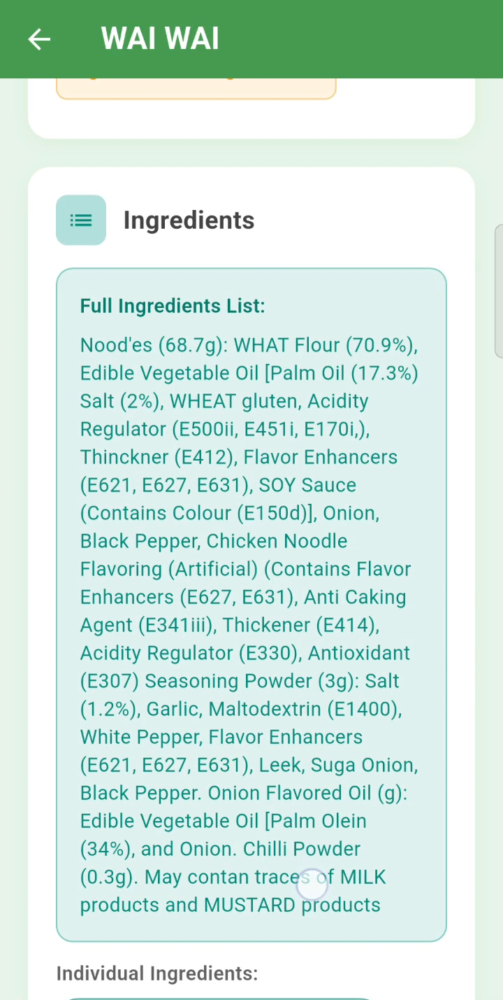

# Aahar 📱

*Know what you eat*

Aahar is a comprehensive Flutter app that empowers users to make informed and healthy food decisions through intelligent barcode scanning and personalized dietary insights.

## 🎯 Mission

Help users make quick, informed, and healthy food choices by providing instant access to comprehensive food information, dietary compatibility checks, and personalized health insights.

## ✨ Key Features

### 📸 Smart Barcode Scanner
- **Instant Food Recognition**: Scan any food barcode for immediate insights
- **Diet Type Detection**: Quickly identify if products are vegetarian, non-vegetarian, or vegan
- **OpenFoodFacts Integration**: Powered by comprehensive food database

### 🍽️ Dietary Compatibility & Health Insights
- **Dietary Restrictions**: Check compatibility with gluten-free, sugar-free, and diabetic diets
- **Allergen Detection**: Identify potential allergens in food products
- **Health Risk Assessment**: Get warnings for hypertension, cholesterol, and gluten intolerance risks
- **Ingredient Analysis**: Detailed breakdown of food ingredients

### 🧠 AI-Powered Features
- **Mood Prediction**: Understand how foods might affect your mood
- **Intelligent Chatbot**: Ask questions about diet, food labels, nutrients, and nutrition advice
- **Personalized Recommendations**: Get tailored food suggestions based on your profile

### 📚 Daily Health Education
- **Rotating Articles**: Fresh daily content on healthy eating habits
- **Dietary Tips**: Expert advice on nutrition and wellness
- **Health Alerts**: Stay updated on recent food safety and health notifications

### 👤 Personalized Experience
- **User Profile Management**: Store personal dietary preferences and restrictions
- **Theme Customization**: Dark mode and other visual preferences
- **History Tracking**: Keep track of scanned products and insights

## 📱 App Interface Preview

Scroll through the interface screenshots below to get a quick overview of the app design and flow.

<div style="display: flex; overflow-x: auto; gap: 10px;">
  
  
  
  
  
  
  
  
  
  
  
  
  
  
  
</div>

## 🚀 Getting Started

### Prerequisites
- Flutter SDK (version 3.0 or higher)
- Dart SDK
- Android Studio / VS Code
- An Android/iOS device or emulator

### Installation

1. **Clone the repository**
   ```bash
   git clone https://github.com/yourusername/aahar.git
   cd aahar
   ```

2. **Install dependencies**
   ```bash
   flutter pub get
   ```

3. **Run the app**
   ```bash
   flutter run
   ```

## 🔧 Configuration

### API Setup
1. **OpenFoodFacts API**: No API key required - uses public OpenFoodFacts database
2. **AI Chatbot**: Configure your AI service credentials in `lib/config/api_config.dart`

### Permissions
The app requires the following permissions:
- **Camera**: For barcode scanning
- **Internet**: For API calls and data fetching
- **Storage**: For caching food data and user preferences

## 📱 How to Use

1. **Scan Products**: Point your camera at any food barcode
2. **Review Insights**: Get instant information about diet compatibility, allergens, and health risks
3. **Check Compatibility**: See if the product matches your dietary restrictions
4. **Ask Questions**: Use the AI chatbot for personalized nutrition advice
5. **Stay Informed**: Read daily articles about healthy eating
6. **Customize Profile**: Set your dietary preferences and health goals

## 🎥 App Demo Video

[](https://www.youtube.com/watch?v=YOUR_VIDEO_ID)


## 🤝 Contributing

We welcome contributions! Please follow these steps:

1. Fork the repository
2. Create a feature branch (`git checkout -b feature/amazing-feature`)
3. Commit your changes (`git commit -m 'Add amazing feature'`)
4. Push to the branch (`git push origin feature/amazing-feature`)
5. Open a Pull Request


## 🙏 Acknowledgments

- **OpenFoodFacts**: For providing comprehensive food database
- **Flutter Community**: For amazing packages and support
- **Contributors**: Thank you to all contributors who help make Aahar better

## 📞 Support

For support, email support@aahar.app or join our community discussions.

## 📈 Roadmap

- [ ] Integration with fitness apps
- [ ] Recipe suggestions based on dietary preferences
- [ ] Multi-language support


---

**Made with ❤️ for healthier food choices**
